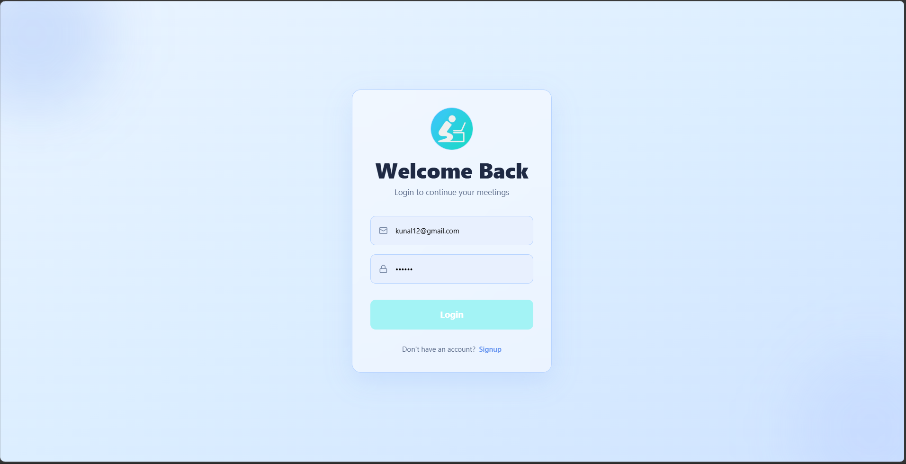
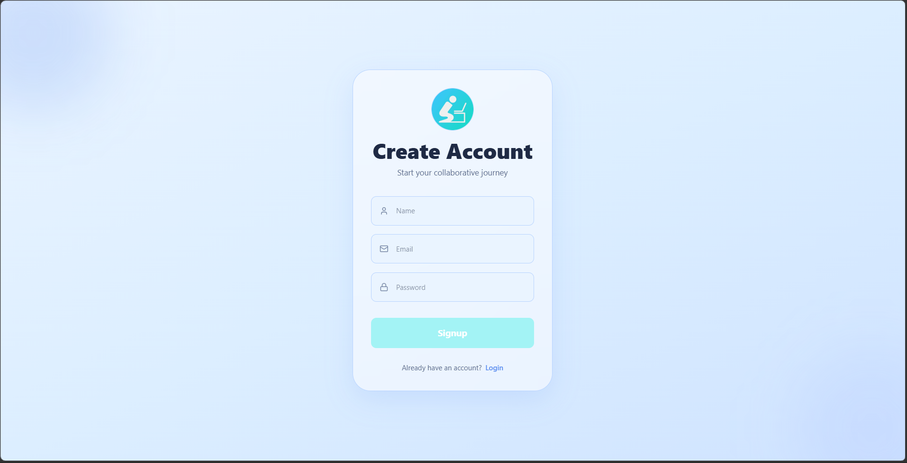
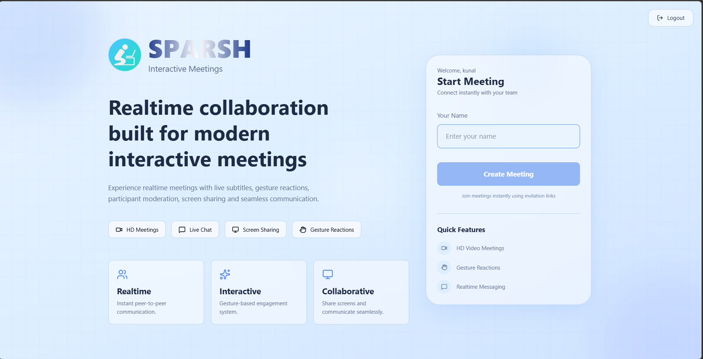
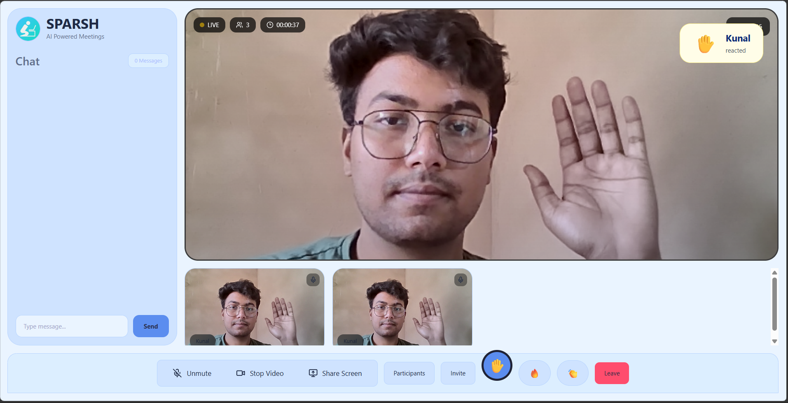
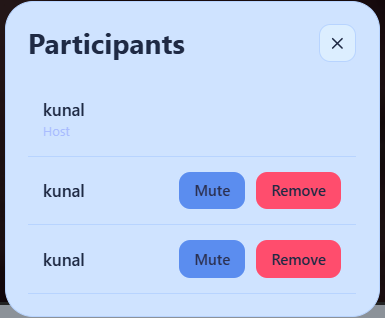
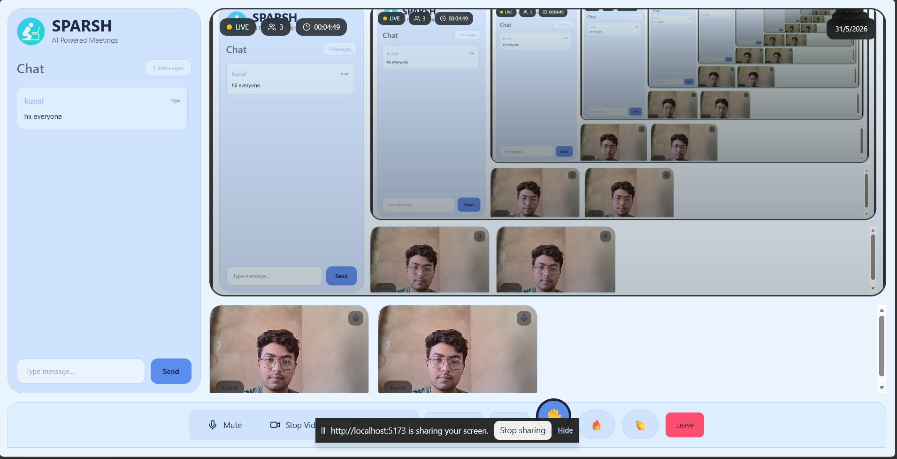

# SPARSH

A modern video conferencing platform built using React, Node.js, WebRTC, and Socket.IO. SPARSH enables users to securely create and join video meetings with real-time audio/video communication directly in the browser.

---

## Features

### Authentication & Security

* User Registration and Login
* JWT-Based Authentication
* Protected Routes
* Session Persistence
* User Verification using `/auth/me`
* Secure API Access

### Meeting Management

* Create New Meetings
* Join Meetings using Meeting ID
* Meeting Dashboard
* Participant Connection Handling

### Real-Time Communication

* WebRTC-Based Peer-to-Peer Communication
* Live Video Streaming
* Live Audio Streaming
* Camera Toggle
* Microphone Toggle
* Screen Sharing

### User Interface

* Responsive Design
* Modern and Clean UI
* Loading States During Authentication
* Smooth Animations
* Easy Meeting Controls

---

## Tech Stack

### Frontend

* React.js
* React Router
* Tailwind CSS
* Axios
* Framer Motion

### Backend

* Node.js
* Express.js
* MongoDB
* JWT Authentication

### Real-Time Communication

* WebRTC
* Socket.IO
* STUN/TURN Servers

---

## Project Structure

```bash
SPARSH
│
├── client
│   ├── public
│   └── src
│       ├── assets
│       ├── components
│       ├── pages
│       ├── services
│       ├── hooks
│       └── utils
│
├── server
│   ├── controllers
│   ├── middleware
│   ├── models
│   ├── routes
│   ├── sockets
│   └── config
│
└── README.md
```


---

## How It Works

1. Users register or log in to the platform.
2. JWT tokens are generated after successful authentication.
3. Protected routes verify users before granting access.
4. Users can create a new meeting or join an existing meeting using a meeting ID.
5. Socket.IO handles signaling between participants.
6. WebRTC establishes direct peer-to-peer communication.
7. Audio and video streams are exchanged in real time.

---

## Screenshots

### Landing Page


### Login Page



### Signup Page



### Dashboard



### Meeting Room



### Participants



### Screen Sharing




---

## Future Improvements

* AI-Powered Meeting Summaries
* Automatic Meeting Transcripts
* Meeting Recording
* Group Video Conferencing
* In-Meeting Chat
* Calendar Integration
* Meeting Scheduling
* Waiting Room Functionality
* Virtual Background Support

---

## Learning Outcomes

Through this project, I gained practical experience with:

* Authentication and Authorization
* JWT Security
* Protected Routes
* REST API Development
* React State Management
* MongoDB Integration
* Socket.IO Communication
* WebRTC Fundamentals
* Real-Time Application Development
* Full-Stack Software Development

---

## Author

Developed as a full-stack video conferencing application to explore real-time communication technologies and modern web development practices.
